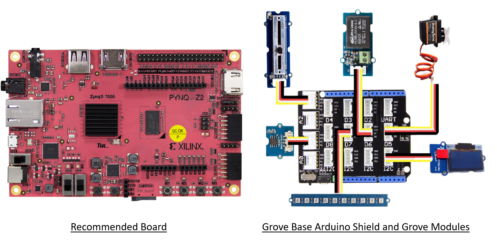

# PYNQ Hackathon Peripheral Modules

This repository contains drivers for Arduino, PMOD, Grove and Raspberry PI
peripherals connected to recommended [PYNQ-Z2](http://www.pynq.io/board.html) board. Each peripheral driver comes with Jupyter
notebooks which show how to use it. 

<p align="center">
  
</p>

All notebooks in this repository are listed below:

__Grove__

| Name | Link to notebook |  Link to Purchase |
|:----------:|:------------------:|:------------------:|
| Grove I2C ADC | [Notebook](https://github.com/Xilinx/PYNQ_peripherals/blob/main/pynq_peripherals/modules/grove_adc/notebooks/grove_adc.ipynb) | [Buy](https://www.seeedstudio.com/Grove-I2C-ADC.html) |
| Grove I2C IMU | [Click Here](https://github.com/npurusho/PYNQ_peripherals-1/blob/main/pynq_peripherals/modules/grove_imu/notebooks/grove_imu.ipynb) | [Buy](https://www.seeedstudio.com/Grove-IMU-10DOF-v2-0.html) |

__Arduino__

| Name | Link to notebook |  Link to Purchase |
|:----------:|:------------------:|:------------------:|
 Grove I2C ADC | [Notebook](https://github.com/Xilinx/PYNQ_peripherals/blob/main/pynq_peripherals/modules/grove_adc/notebooks/grove_adc.ipynb) | [Buy](https://www.seeedstudio.com/Grove-I2C-ADC.html) |
| Grove I2C IMU | [Click Here](https://github.com/npurusho/PYNQ_peripherals-1/blob/main/pynq_peripherals/modules/grove_imu/notebooks/grove_imu.ipynb) | [Buy](https://www.seeedstudio.com/Grove-IMU-10DOF-v2-0.html) |

## Installation

To install the notebooks run

```sh
sudo pip install git+https://github.com/Xilinx/PYNQ_peripherals.git
sudo pynq get-notebooks pynq_peripherals -p $PYNQ_JUPYTER_NOTEBOOKS
```

in your jupyter-notebooks folder.

## Example Hacks

| Name | Link to notebook |  Link to Purchase |
|:----------:|:------------------:|:------------------:|
| Grove I2C IMU | [Click Here](https://github.com/npurusho/PYNQ_peripherals-1/blob/main/pynq_peripherals/modules/grove_imu/notebooks/grove_imu.ipynb) | [Buy](https://www.seeedstudio.com/Grove-IMU-10DOF-v2-0.html) |


## Contributing

See the CONTRIBUTING file for details on how to contribute new peripheral
drivers. We are actively welcoming contributions.

## License

Copyright (C) 2021 Xilinx, Inc

SPDX-License-Identifier: BSD-3-Clause
